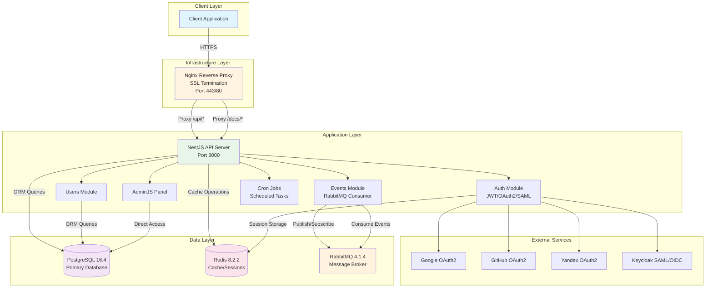

# LightweightProject

A lightweight NodeJS project for training, learning, and practicing modern backend development with NestJS.

## High-Level Overview

This project is a full-featured backend application built with NestJS that demonstrates modern architectural patterns including microservices, event-driven architecture, and multiple authentication strategies. The system uses a reverse proxy (Nginx) for SSL termination and request routing.

The application is designed to be containerized using Docker Compose, providing a complete development environment with PostgreSQL, Redis, and RabbitMQ services.

---

## Tech Stack

### Core Framework & Language
- **Node.js** (>=24.0.0) - Runtime environment
- **TypeScript 6.0.3** - Type-safe JavaScript
- **NestJS** - Progressive Node.js framework for building efficient backend applications

### Database & Storage
- **PostgreSQL 16.4** - Primary relational database
- **TypeORM 1.1.0** - ORM for database operations and migrations
- **Redis 8.2.2** - Caching and session storage

### Message Queue & Events
- **RabbitMQ 4.1.4** - Message broker for event-driven architecture
- **amqplib** - RabbitMQ client for Node.js

### Authentication & Security
- **JWT** - JSON Web Token authentication
- **Passport.js** - Authentication middleware with multiple strategies:
  - Local (username/password)
  - JWT (bearer tokens)
  - Google OAuth2
  - GitHub OAuth2
  - Yandex OAuth2
  - Keycloak SAML/OIDC *(not implemented yet)*
- **bcrypt** - Password hashing
- **Cookie-based sessions** - Secure cookie management

### API Documentation, validation & Admin service
- **Swagger/OpenAPI** - Interactive API documentation
- **AdminJS** - Admin panel for database management
- **Zod** - Schema validation for endpoints

### Reverse Proxy & SSL
- **Nginx 1.31.2** - Reverse proxy, SSL termination, and static file serving
- **Self-signed certificates** - HTTPS support in development

### Development Tools
- **Jest** - Testing framework (unit and e2e tests)
- **ESLint** - Code linting
- **Prettier** - Code formatting
- **Docker Compose** - Container orchestration

## Project Structure

```
LightweightProject/
├── client/                    # Frontend application (currently empty)
├── server/                    # NestJS backend application
│   ├── src/
│   │   ├── admin/            # AdminJS configuration and setup
│   │   ├── auth/             # Authentication module (strategies, guards, controllers)
│   │   ├── common/           # Shared utilities, decorators, and helpers
│   │   ├── configs/          # Configuration files and interfaces
│   │   ├── events/           # Event handling with RabbitMQ consumers
│   │   ├── services/         # External service integrations
│   │   │   ├── cron/        # Scheduled tasks with @nestjs/schedule
│   │   │   ├── redis/       # Redis client configuration
│   │   │   └── rmq/         # RabbitMQ microservice setup
│   │   ├── tokens/           # JWT token management
│   │   ├── users/            # User management module
│   │   ├── utils/            # Utility functions
│   │   ├── app.module.ts     # Root application module
│   │   └── main.ts           # Application bootstrap
│   ├── dist/                 # Compiled JavaScript output
│   ├── migrations/           # TypeORM database migrations
│   ├── tests/                # E2E test configuration
│   └── templates/            # Email templates (EJS)
├── shared/                    # Shared resources between client and server
│   └── img/                  # Shared images
├── nginx/                     # Nginx configuration
│   ├── nginx.conf.conf       # Main nginx configuration
│   └── entrypoint.sh         # Container entrypoint script
├── init/                      # Database initialization scripts
│   └── db/                   # SQL scripts for database setup
├── certs/                     # SSL certificates
│   └── selfsigned/          # Self-signed certificates for development
├── compose.yaml              # Production Docker Compose configuration
├── compose.development.yaml  # Development Docker Compose configuration
├── Dockerfile                # Docker image build configuration
├── package.json              # Root package.json with scripts
├── tsconfig.json             # TypeScript configuration
└── .env                      # Environment variables (not committed)
```

## Data Flow & Interactions

### Request Flow

1. **Client Request** → HTTPS request to Nginx (port 443)
2. **SSL Termination** → Nginx decrypts the request using SSL certificates
3. **Routing** → Nginx routes requests based on path:
   - `/api/*` and `/docs/*` → Proxy to NestJS backend (port 3000)
   - `/` → Static content or placeholder response
4. **Backend Processing** → NestJS handles the request:
   - Authentication guards verify JWT tokens or OAuth sessions
   - Controllers process the business logic
   - Services interact with databases and external services
5. **Response** → Response flows back through Nginx to the client

### Authentication Flow

The application supports multiple authentication strategies:

- **Local Strategy**: Username/password with JWT token generation
- **OAuth2 Providers**: Google, GitHub, Yandex with OAuth2 flow
- **SAML**: Keycloak SAML integration for enterprise SSO *(not implemented yet)*
- **JWT Bearer**: Token-based authentication for API calls

### Event-Driven Architecture

- **Event Producers**: Services emit events to RabbitMQ exchanges
- **Event Consumers**: Dedicated consumers listen to queues and process events asynchronously
- **Decoupling**: Producers don't need to know about consumers, enabling scalable architecture

### Database Interactions

- **TypeORM**: Manages database connections and provides ORM functionality

### Caching Strategy

- **Redis**: Caches frequently accessed data (tokens, user data)
- **Session Storage**: Stateless JWT tokens with refresh tokens stored in PostgreSQL
- **Cache Invalidation**: TTL-based expiration and manual invalidation

## Architecture Diagram



## Key Features

- **Multi-Provider Authentication**: Support for local, JWT, and multiple OAuth2/SAML providers
- **Event-Driven Architecture**: RabbitMQ integration for asynchronous event processing
- **API Documentation**: Auto-generated Swagger/OpenAPI documentation
- **Admin Panel**: AdminJS for database management and content administration
- **Scheduled Tasks**: Cron jobs for periodic operations
- **Caching Layer**: Redis integration for performance optimization
- **SSL/TLS**: HTTPS support with Nginx SSL termination
- **Type Safety**: Full TypeScript implementation with Zod validation
- **Testing**: Comprehensive unit and e2e testing with Jest
- **Docker Support**: Complete containerization with Docker Compose

## Getting Started

### Prerequisites

- Docker and Docker Compose
- Node.js >=24.0.0
- npm or yarn

### Installation

1. Clone the repository
2. Copy environment and fill variables: `cp .env.public .env`
3. Start services with Docker Compose: `docker-compose up -d`
4. Install dependencies: `npm install`
5. Run database migrations: `npm run typeorm:run`
6. Start the development server: `npm run start:server:dev`
7. Start th microservice (rmq) development server: `npm run start:microservice:rmq:dev`

## API Documentation

Once the server is running, access the interactive API documentation at:
- Swagger UI: `https://localhost/docs`
- OpenAPI JSON: `https://localhost/docs/json`
- OpenAPI YAML: `https://localhost/docs/yaml`

## Admin Panel

Access the AdminJS panel for database management (if configured):
- URL: `https://localhost/admin` (route configuration dependent)

## License

UNLICENSED
